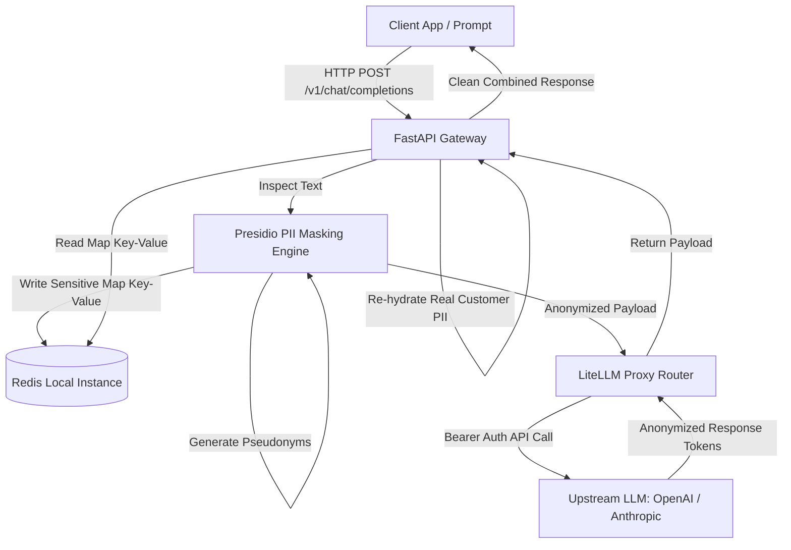

# High-Compliance PII Masking AI Gateway

A production-ready, ultra-low latency API gateway designed to inspect, scrub, and re-hydrate sensitive data (PII/PHI) before routing requests to third-party LLM providers. Built using **FastAPI**, **Microsoft Presidio**, **LiteLLM**, and **Redis**.

---

## 🎯 Architectural Mission Statement

Modern enterprises are blocked from utilizing public Large Language Models (LLMs) due to strict data sovereignty, compliance framework requirements (GDPR, HIPAA, SOC2), and privacy leaks. 

This gateway acts as an **Air-Gapped Privacy Proxy**. It intercepts outbound prompts, uses advanced Named Entity Recognition (NER) to isolate data points like names, emails, and credentials, caches them locally inside an ephemeral state store, and passes a entirely anonymized payload to external APIs. Responses are seamlessly re-hydrated back to the client, ensuring the external LLM vendor **never** sees or logs sensitive raw infrastructure inputs.

### Core Architectural Pillars
* **Zero-Footprint Storage**: Customer PII never touches persistent disk storage; mappings exist exclusively in an isolated, high-speed memory cache.
* **Microsecond-Scale Lookups**: Ephemeral token mapping is powered by Redis to prevent bottlenecking modern streaming LLM response architectures.
* **Vendor Agnosticism**: Standardized routing layer powered by LiteLLM abstracts the underlying provider, making models easily swappable without modifying application compliance code.

---

## 🏗️ System Architecture



---

## 📁 Repository Scaffolding

```text
high-compliance-ai-gateway/
├── .github/workflows/   # CI/CD pipelines and static analysis linting
├── docs/                # Architecture diagrams and Architectural Decision Records (ADRs)
├── src/                 # Application codebase
│   ├── app/             # Application logic (FastAPI, Masking engine, Proxy)
│   └── tests/           # Unit and integration test suites
├── docker-compose.yml   # Multi-container orchestrator for local development
└── requirements.txt     # Locked production and testing dependencies
```

---

## ⚡ Quick Start (Local Development)

### Prerequisites
* Docker & Docker Compose
* Python 3.11+ (for local virtual environments)

### 1. Clone & Spin Up Local Infrastructure
Spin up the isolated application container alongside the customized memory-capped Redis instance:
```bash
git clone <your-repo-url>
cd high-compliance-ai-gateway
docker-compose up --build
```

### 2. Verify Infrastructure Health
The API gateway runs on port `8000`. Test the automated routing documentation by navigating to:
```text
http://localhost:8000/docs
```

---

## 🔒 Compliance & Security Engineering

* **LRU Cache Eviction**: The Redis data store is explicitly configured with `maxmemory-policy allkeys-lru` and low TTL commands to ensure token states are automatically purged from memory.
* **No Local State**: The FastAPI application container is designed strictly stateless to align with modern Kubernetes and serverless horizontal scaling patterns.
