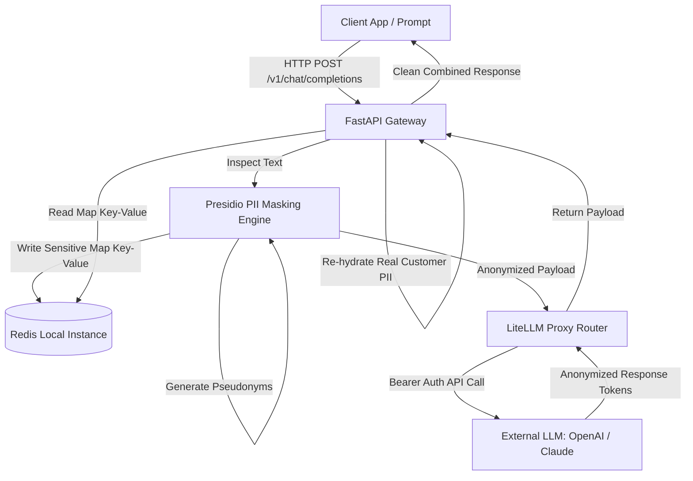

# System Architecture Diagram

```mermaid
graph TD
    Client[Client App / Prompt] -->|HTTP POST /v1/chat/completions| API[FastAPI Gateway]
    API -->|Inspect Text| Engine[Presidio PII Masking Engine]
    Engine -->|Generate Pseudonyms| Engine
    Engine -->|Write Sensitive Map Key-Value| Redis[(Redis Local Instance)]
    Engine -->|Anonymized Payload| Router[LiteLLM Proxy Router]
    Router -->|Bearer Auth API Call| LLM[External LLM: OpenAI / Claude]
    LLM -->|Anonymized Response Tokens| Router
    Router -->|Return Payload| API
    API -->|Read Map Key-Value| Redis
    API -->|Re-hydrate Real Customer PII| API
    API -->|Clean Combined Response| Client
```
